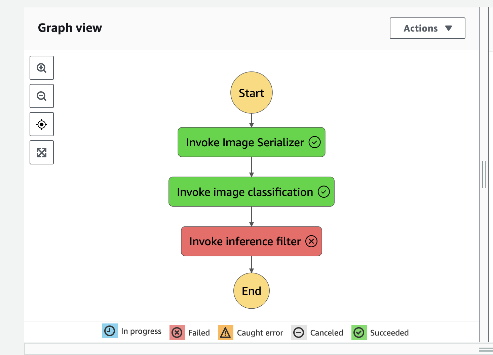

# Machine Learning Workflow for Scones Unlimited Image Classification with AWS SageMaker

## Overview

This project involves building an image classification model that can distinguish between bicycles and motorcycles. AWS SageMaker is used for model building and deployment, AWS Lambda for supporting services, and AWS Step Functions to orchestrate the entire workflow.

Successful for inferences below our confidence threshold


Failing for inferences below our confidence threshold


## Steps

1. **Data Staging**: Data collection and pre-processing.
2. **Model Training and Deployment**: Using AWS SageMaker.
3. **Lambdas and Step Function Workflow**: Creating the event-driven application.
4. **Testing and Evaluation**: Evaluating model performance.
5. **Optional Challenge**: Extension and scalability aspects.
6. **Cleanup**: Removing cloud resources to avoid additional costs.

## Challenges and Learnings

### Lambda Functions and Dependencies

The initial attempt to use SageMaker SDK in Lambda functions faced dependency issues. The workaround was to use `boto3.client('runtime.sagemaker')` for making predictions.

```python
runtime= boto3.client('runtime.sagemaker')
predictor = runtime.invoke_endpoint(
    EndpointName=ENDPOINT,
    ContentType='application/x-image',
    Body=image
)
```

### Extending the Workflow

- The project successfully implemented a "dummy data" generator for simulating a continuous stream of input data.
- Explored ways to get notified when the Step Function errors out using AWS SNS.

## Outcome and Hypotheses

The model overtime showed better classification for motorcycles than bicycles, although the confidence levels are low.


### Hypotheses:

1. **Overfitting**: The model may have been trained on a limited dataset.
2. **Data Labeling**: Ground truth setup in SageMaker could provide insights into mislabeling.
3. **Resolution**: Low-resolution images may be affecting the model's performance.
4. **Class Imbalance**: There may be a bias towards the class with more examples.

## Future Work

- Incorporate more classes into the model.
- Parallelize Lambda functions to process multiple images.
- Retrain the model based on Ground Truth labeling.